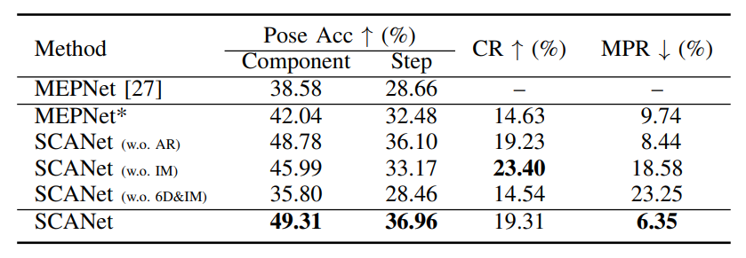

## 1.论文介绍
本文介绍我们最近被**IROS2024**接收的工作：**SCANet: Correcting LEGO Assembly Errors with Self-Correct Assembly Network**。这项工作主要研究对组装过程中出现的错误组件进行纠错从而提升机器人组装的准确性。这篇工作最终入围为 **finalist of IROS 2024 best application award**，本次会议一共收到了3645篇投稿，其中只有4篇论文入围了此项奖项的候选人名单。

**论文主页**：https://scanet-iros2024.github.io/

## 2.引言
长期以来，如何赋予机器人根据装配手册实现自主装配的能力一直是机器人社区研究的一个焦点。在我们对先前工作研究的过程中发现，目前已有的工作在进行组装配件过程中有可能会出现组装错误的情况。并且随着错误的不断累积，最终组装的结果会与正确的组装结果相去甚远。对于人类来说，我们有能力在后续的组装过程中发现并纠正这些错误，但是这一点对于机器人来说却十分难以实现。因此，对于该领域的空白，我们提出了一种新的任务：**单步组装纠错任务（Single-Step Assembly Error Correction）**。

该任务带来了两个全新的挑战：**首先是需要识别拼装错误的组件，之后是如何将拼装错误的组件纠正到正确的位置**。面对上述问题，我们首先构造了专门用于单步组装任务的数据集**LEGO—ECA**，之后我们提出了**自纠错组装网络**（SCANet）来用于解决单步组装纠错任务。

## 3.数据集
这个数据集是我们基于[MEPNet](https://arxiv.org/abs/2207.12572 "Translating a Visual LEGO Manual to a Machine-Executable Plan. ECCV, 2022")中合成LEGO数据集而建立的，我们在合成LEGO数据集中随机挑选了1429个组装手册，将其输入至MEPNet，并加入随机高斯噪声来干扰MEPNet组装过程，这样我们得到了丰富的错误组装样例，从而构建了包含约12万种错误样例的数据集。

## 4.自纠错组装网络方法介绍
**自纠错组装网络**（SCANet）专门用于解决单步组装纠错问题，其构架灵感来源于[DETR](https://arxiv.org/abs/2005.12872 "End-to-End Object Detection with Transformers. ECCV, 2020"),整体结构分为两个关键模块。

### 卷积神经网络骨干
这一部分核心是挖掘并提取组装手册图像和实际组装结果的差异特征，并将特征传递给后续较正模块。这一部分与MEPNet结构类似，均包含Image-Shape融合模块与[Hourglass模型](https://arxiv.org/abs/1603.06937 "Stacked Hourglass Networks for Human Pose Estimation. ECCV, 2016")。不过，SCANet 具有两个输入分支：用于输入手册图像信息和上一步组装后3D几何信息的Manual-Shape分支以及用于输入当前组装的渲染图像和3D集合信息的Assembly-Shape分支。两个分支具有相同的网络结构，共享权重参数。此外，该模块中还有一个差异提取器，用于提取前两部分的差异特征。该提取器将两个分支的输出在通道层面进行拼接，通过压缩通道的方式来提取差异特征，差异提取器由两个残余块组成。

### 组装较正模块
该模块的任务是判断组件是否正确组装，倘若存在错误，则对错误进行纠正。该模块由三部分组成：组件姿态编码器、Transformer网络以及组件姿态纠正器。该模块对从卷积神经网络骨干部分得到的差异特征，组件的3D体素数据，组件组装后的2D图像以及组件的6D姿态信息进行处理，输出组件的状态信息以及纠正后的组件6D姿态。

组件姿态编码器包括：3D体素编码器、6D姿态编码器和2D图像编码器。
- 3D体素编码器：采用多个3D Conv-BN-ReLU模块，然后接一个平均池化层和一个展平层，将3D体素数据编码为一维向量特征。
- 6D姿态编码器：由两层全连接层组成，接收组件的6D姿态信息，并进行归一化处理，输出编码后的一维向量特征。在此过程中，将6D姿态编码器的特征向量与3D体素编码器输出的特征向量进行叠加，以融合二者的信息。
- 2D图像编码器：采用ResNet网络结构，接受每个组件的2D图像数据，并输出经编码后的组件图像特征。

在此处，不仅编码每个组件的6D姿态信息，还编码了每个组件的2D图像信息，是因为研究发现，在纠错过程中，如果在某个组装步骤中存在多个相同形状的组件，它们仅在6D姿态上有所不同，SCANet在进行纠错时可能将它们都错误地纠正到同一个位置上。而包含组件颜色信息的图像信息可以在一定程度上缓解这一问题。

组件姿态纠正器由三个结构不同的小型全连接神经网络组成：组件状态分类器、组件3D位置纠正头和组件3D旋转纠正头。
- 组件状态分类器：SCANet采用了两层全连接层。该分类器的输出是一个长度为4的特征向量，分别表示组装正确、位置错误、旋转错误以及位置和旋转同时错误这四种情况。
- 组件3D位置纠正头：SCANet参考了[SimCC](https://arxiv.org/abs/2107.03332 "SimCC: a Simple Coordinate Classification Perspective for Human Pose Estimation. ECCV, 2022")的网络结构，将每个组件的3D坐标视为x、y、z三个方向的分类任务。该纠正头输出三个特征向量，其长度与体素网格在每个方向上的大小保持一致。
- 组件3D旋转纠正头：SCANet类似于MEPNet的方法，将不同的旋转角度（0°、90°、180°、270°）作为分类任务。然而，在处理组件的对称性时，SCANet有所不同。该研究简化了处理，即在输出旋转纠正结果时不考虑对称性，但在具体的纠正过程中，会对组件的对称性进行判断（每个组件的对称性可以事先人为构建）。例如，如果某个组件在k个旋转角度上具有对称性，则将其视为其中一个角度。例如，如果某个组件在0°和180°处具有对称性，则其旋转纠正结果可被视为0°。

## 5.实验结果
从组装纠错的实验结果，可以看到SCANet可以有效地对MEPNet的组装结果进行纠错，无论是否见过该数据集，纠错效果都十分显著。

此外，我们还进行了消融实验，探索SCANet的网络结构，我们首先对MEPNet进行了改造，使其能够适应组装纠错这个任务，可以看到改造后的MEPNet也可以进行组件的纠错，但相较于我们的方法还是有一定的差距。

最后，我们去掉了SCANet的部分结构：
- 在去掉组装结果的分支，只保留手册图像的分支后，可以看到性能略有下降；
- 在去掉姿态编码器中的2D图像编码器之后，性能下降十分明显，因此这个2D图像编码器确实在一定程度上缓解了前文提到的问题；
- 我们进一步去掉了6D姿态编码器，可以看到去掉后性能下降的十分剧烈，甚至还不如原始的MEPNet了，这也进一步证明了我们6D姿态编码器的重要性。

## 6.局限与未来展望

- 现在的方法在纠错时，是直接输出纠正后，模型认为正确的组件姿态，这种方式虽然可行但也还是存在泛化问题，事实上，我们在另一个与训练数据集差异较大的数据集上进行测试时发现，纠正的效果就大打折扣了。一个更好且泛化性更高的纠正策略应该是，输出组件错误姿态与正确姿态之间的差距，并且迭代式的进行纠错，也就是慢慢的向正确姿态靠拢。
- 目前进行纠错的时候只是考虑第T时刻的组件，但事实上有时候错误早在T时刻之前就发生了，因此多步纠错还是有必要探索的，或许可以设置一个纠错窗口，考虑这个窗口内的组件也许是个可行的策略。
- 现在纠错与组装是完全分离的，是两个独立的网络，因此效率并不高，将两者整合到一起进行或许更好。

